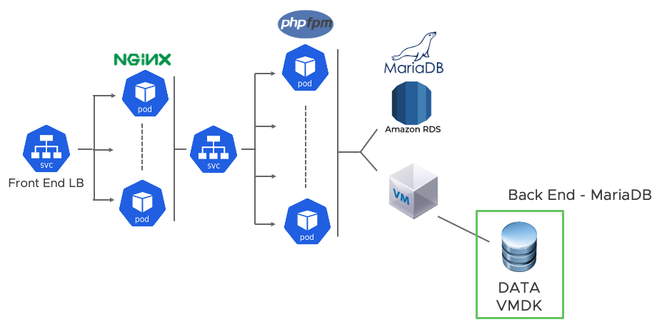
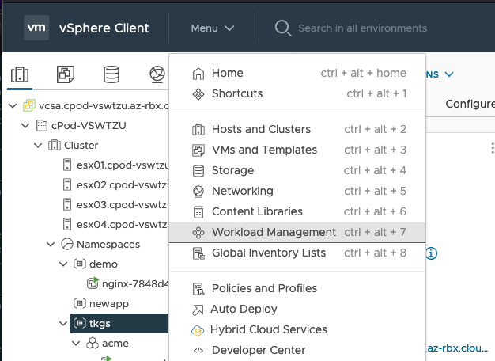
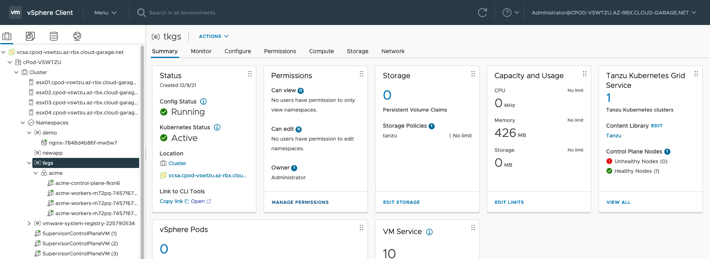
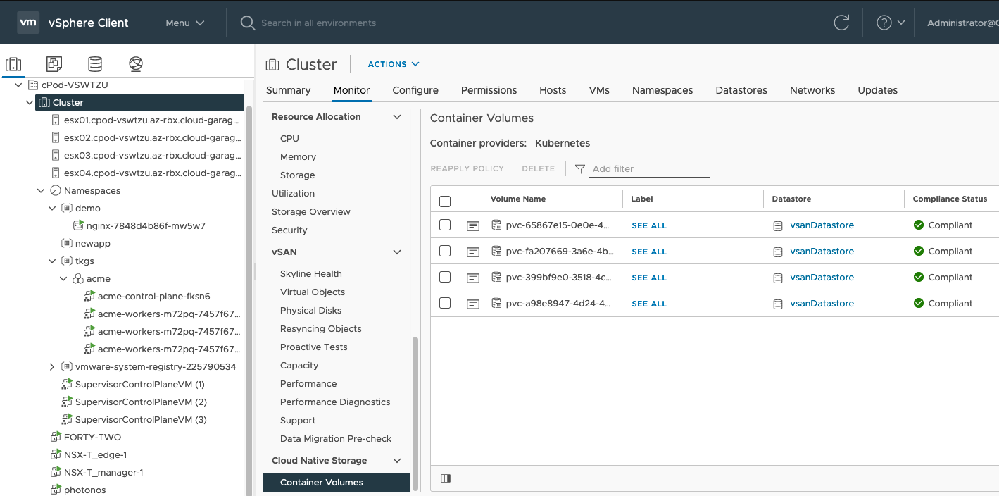

# Lab Guide Day 2

# Introduction
This second part of this workshop is dedicated to the App Modernization topics and relies mainly on VMware Tanzu, our container management solution which is now also available on VMware Cloud on AWS as you will see during labs.

You will use user `roomX` / `roomX` (X is an integer) on jumpbox call grease-monkey. One user per group, suggested app has been extracted and based on one running on previous front-end VM. So, the main purpose
is to run 2 distinct pods instead of a VM: nginx + phpfm. The intend to do that is to leverage k8s capabilities to easyly scale application depending on number of request.

# Lab200: VMC + Tanzu
We have initiated TKG deployment in this VMC instance, roughly similar to on-premise installation.
Navigate through UI, discover how Tanzu manage K8S Workload Cluster: supervisor cluster namespaces, how to limit CPU/Memory/Storage per namespace & Cloud Native Storage. 
Tanzu offer SSO between VCSA and Kubernetes.

Worload Management Menu in VCSA: 

Supervisor Namespace Management:

Cloud Native Storage in VCSA:

# Lab201: Discovery and setup
Get you familliar with jumpbox with proxy socks, use ssh or ptty: `ssh -D 9090 roomX@grease-monkey-vmc.cloud-garage.net`
Clone the git repo in home: `git clone https://github.com/cdebosc/VMCwithHCX-Tanzu.git`
Take time to discover directory structure, specificaly `~/VMCwithHCX-Tanzu/Lab-Guide_Day2` and `~/VMCwithHCX-Tanzu/Tanzu` dirs.

Setup your favorite browser to use local proxy socks: settings -> advanced -> system -> open your computer's proxy settings -> select socks with localhost:9090

test it in running local nginx container on grease-monkey and access it:
`docker run -d -p $(expr $( ech: ${USER} | sed "s/room//") + 8080):80 --name=${USER} nginx`
You should able to visit http://grease-monkey:[your_port_number]

As a DevSecOps team member you have access to source code of the app. Go to `~/VMCwithHCX-Tanzu/Tanzu/VMs2PODs` directory.
If you are brave enough, you can modify some artefacts like: `~/VMCwithHCX-Tanzu/Tanzu/VMs2PODs/containers/html/index.html`  
If you get lost or confused, reclone repo in order to start from scratch

It's time to build application.

# Lab202: Create registry project
Sign up with your creds `roomX` / `roomX` to [VMware Harbor](https://registry.cloud-garage.net).
Log into and create project with name of your user, don't forget to set it public.

# Lab203: Build the app
Go to `~/VMCwithHCX-Tanzu/Tanzu/VMs2PODs` directory and inspect/modify `env` file specifying all settings.
Now, were going to build app containers with the help of `./build.sh`.
Inspect your fresh container images: `docker images`.

# Lab204: Push container images to registry
Log yourself to registry: `docker login registry.cloud-garage.net`, your creds are quite obvious.
Push to reg with: `./push.sh`. You are invited to discover `containers/Makefile`.
Inspect the result into Harbor. Launch a vulnerability scan against freshly pushed images, what is the result?
Modify your project to automaticaly scan any new pushed images and avoid to deploy ones low and higher vulnerability severities.

# Lab205: Deploy application
With the help of `./deploy.sh`, app is now running in namespace of your name.
Inspect deployment with: `kubectl -n ${USER} get pods,svc`.
What do you conclude? Does it match with your exspectations?

Inspect furthermore with: `kubectl -n ${USER} get networkpolicies,hpa`.

Try to access app from your favorite browser. Does it work?

Try to run busybox pod in your namespace and reach php page: `kubectl -n ${USER} run -it --rm busybox --image=busybox -- sh` and ``
What is the result? Why?

Load the app and discover how k8s scale deployments: `./scale_in_pods.sh`.

Tips: there is a namespace that's running Octant.

# Lab206: Tanzu Management 
Tanzu offer a flexible way to manage k8s cluster, scale out/in clusters is an exmaple. Because k8s clusters are operated by k8s, all is yaml.
Go to `~/VMCwithHCX-Tanzu/Tanzu/tkgs/guest-cluster` dir and discover how we deploy cluster with `create-managed-cluster.yaml`.
What do you notice in this yaml?

t's needed to be login into suprervisor cluster and workload cluster, there are scripts for that in `~/VMCwithHCX-Tanzu/Tanzu`: `./login.sh` and `login-guest-cluster.sh`.

It's possible to directly manage cluster with `tanzukubernetesclusters.run.tanzu.vmware.com` object: `kubectl get tkc -A`.
In place k8s release upgrade is possible. To do that, edit tkc item and change version accordingly to what Tanzu offer, for example: `kubectl -n tkgs edit tkc acme` and replace version.

!!! Don't modify relrease right now !!! 

# Lab207: Tanzu Monitoring
Tanzu offer prometheus/grafana to monitor k8s cluster and apps. There is also Tanzu Observability, SaaS solution offering monitoring/distributed tracing/correlated events.
Let's discover how to attach a cluster to TO and look at dashboard.

# Lab208: Switching back-end VM to AWS native services
The goal is to replace VM database by RDS instance in aws.
So, create your own RDS instance. Export/Import mariadb schema in RDS. Modify env file to point to RDS instance. Rebuild/repush/redeploy app or modify your existing running app.
Is a big deal to use managed service in aws? what's about performance and lifecycle management? What's about the cost?
